# SmartBundle Monorepo Support Guide

## Overview

SmartBundle provides seamless monorepo support for pnpm workspaces, enabling efficient development and bundling of TypeScript/JavaScript packages. This guide explains how to use SmartBundle in a monorepo environment.

## The Problem

When building packages in a monorepo, developers face a fundamental dilemma:

**Option 1: Work with Source Files**
- ✅ Fast development with hot reloading
- ✅ Easy debugging with original code
- ❌ Can't test the actual bundled output
- ❌ Different behavior in development vs production

**Option 2: Build Everything First**
- ✅ Test with real bundled code
- ✅ Accurate production behavior
- ❌ Slow development (rebuild after every change)
- ❌ Complex build watchers and configurations

## How SmartBundle Solves It

SmartBundle uses a simple naming convention to give you the best of both worlds:

1. **Add `-sbsources` suffix** to packages that need bundling
2. **Run `smartbundle-monorepo-link`** to set up the magic
3. **Use clean names** (no suffix) in dependencies and imports

### Visual Overview


### Development vs Production

```mermaid
graph TB
    subgraph "Development Mode"
        Dev1[import from '@company/ui']
        Dev2[→ TypeScript source files]
        Dev3[→ Hot reloading ✨]
        Dev1 --> Dev2 --> Dev3
    end
    
    subgraph "Production Mode"
        Prod1[import from '@company/ui']
        Prod2[→ Optimized bundles]
        Prod3[→ ESM + CommonJS 📦]
        Prod1 --> Prod2 --> Prod3
    end
    
    style Dev1 fill:#e8f5e9
    style Dev2 fill:#e8f5e9
    style Dev3 fill:#e8f5e9
    style Prod1 fill:#fff3e0
    style Prod2 fill:#fff3e0
    style Prod3 fill:#fff3e0
```



## Getting Started

### Prerequisites

Create a `pnpm-workspace.yaml` in your monorepo root:

```yaml
packages:
  - 'packages/*'
  - 'packages/*/dist'  # Include link packages
```

> [!IMPORTANT]
> Currently, only pnpm workspaces are supported. npm and Yarn workspace support is planned for future releases.

### Step 1: Create Your Package

Add `-sbsources` suffix to your package name:

```json
// packages/ui/package.json
{
  "name": "@mycompany/ui-sbsources",
  "version": "1.0.0",
  "type": "module",
  "private": true,
  "exports": "./src/index.ts"
}
```

> [!TIP]
> The suffix goes in the package.json `name` field only. Folder names can be anything you prefer.

### Step 2: Generate Link Packages

Run the magic command:

```bash
smartbundle-monorepo-link
```

This command automatically:
- Finds all packages with `-sbsources` suffix
- Creates link packages for each one
- Sets up all the wiring so imports work

### Step 3: Install Dependencies

```bash
pnpm install
```

### Step 4: Use Your Package

In dependent packages, use the clean name (no suffix):

```json
// packages/app/package.json
{
  "name": "@mycompany/app",
  "dependencies": {
    "@mycompany/ui": "workspace:*"  // No suffix!
  }
}
```

```typescript
// packages/app/src/App.tsx
import { Button } from '@mycompany/ui';  // No suffix!
```

## Common Workflows

### Adding a New Package

```bash
# Create package structure
mkdir -p packages/my-lib/src

# Create package.json with suffix
cat > packages/my-lib/package.json << EOF
{
  "name": "@mycompany/my-lib-sbsources",
  "version": "1.0.0",
  "type": "module",
  "private": true,
  "exports": "./src/index.ts"
}
EOF

# Create source file
echo 'export const hello = () => "Hello!"' > packages/my-lib/src/index.ts

# Generate link package
smartbundle-monorepo-link

# Update pnpm workspace
pnpm install
```

### Building for Production

```bash
# Build all -sbsources packages
smartbundle

# Your packages are ready for publishing!
```

### CI/CD Pipeline

```bash
# Install dependencies
pnpm install

# Verify link packages are up-to-date
smartbundle-monorepo-link --ci

# Build everything
smartbundle

# Run tests
pnpm test

# Publish packages
cd packages/my-lib/dist && npm publish
```

## Configuration Examples

### React Component Library

```json
{
  "name": "@mycompany/ui-sbsources",
  "version": "1.0.0",
  "type": "module",
  "private": true,
  "exports": {
    ".": "./src/index.ts",
    "./button": "./src/Button.tsx",
    "./theme": "./src/theme.ts"
  },
  "peerDependencies": {
    "react": "^18.0.0"
  }
}
```

> [!TIP]
> For React components, see the [React integration guide](./react.md) for JSX configuration details.

### Shared Utilities

```json
{
  "name": "@mycompany/utils-sbsources",
  "version": "1.0.0",
  "type": "module",
  "private": true,
  "exports": "./src/index.ts",
  "dependencies": {
    "@mycompany/types": "workspace:*"  // Clean name in deps!
  }
}
```

### CLI Tool

```json
{
  "name": "@mycompany/cli-sbsources",
  "version": "1.0.0",
  "type": "module",
  "private": true,
  "bin": {
    "my-cli": "./src/cli.ts"
  },
  "exports": "./src/index.ts"
}
```

## Advanced Topics

### Package Structure

```
packages/
  my-lib/                      # Folder (any name)
    src/
      index.ts                 # Source code
    package.json               # name: "@company/my-lib-sbsources"
    dist/                      # Auto-generated by link command
      package.json             # name: "@company/my-lib"
      index.ts                 # Re-exports from source
```

### Why the `-sbsources` Suffix?

The suffix is essential for:

1. **Package Identification** - Marks which packages need bundling
2. **Workspace Resolution** - Allows source and output to coexist
3. **Build Safety** - Prevents output from overwriting source
4. **Developer Clarity** - Clear distinction between source and consumable packages

### Command Reference

#### `smartbundle-monorepo-link`

Creates and updates link packages for all `-sbsources` packages.

**Options:**
- `--ci` - Validation mode (fails if links are outdated)

**When to run:**
- After adding `-sbsources` suffix to any package
- After creating new packages with the suffix
- After cloning the repository
- When you see import errors

## Troubleshooting

### Cannot find module '@mycompany/ui'

You forgot to run the link command:
```bash
smartbundle-monorepo-link && pnpm install
```

### No projects matched the filters

Check that:
- Package name ends with `-sbsources` (in package.json)
- pnpm-workspace.yaml includes the package location
- package.json is valid JSON

### TypeScript errors after adding suffix

Run the link command and reinstall:
```bash
smartbundle-monorepo-link && pnpm install
```

### Module not found in CI/CD

Add to your CI pipeline:
```bash
smartbundle-monorepo-link --ci
```

## FAQ

### What if I forget to add the suffix?

Your package won't be bundled. SmartBundle only processes packages with `-sbsources`.

### What if I forget to run the link command?

You'll see import errors. Always run `smartbundle-monorepo-link` after adding the suffix.

### What about packages that don't need bundling?

Regular packages work normally:
- Config packages → No suffix needed
- Type-only packages → No suffix needed  
- Already-built packages → No suffix needed

### Do I commit the dist folders?

No. Add to `.gitignore`:
```gitignore
**/dist
```

### How do I migrate an existing monorepo?

1. Add `-sbsources` suffix to packages you want to bundle
2. Update all dependencies to use clean names
3. Update all imports to use clean names
4. Run `smartbundle-monorepo-link`
5. Run `pnpm install`
6. Test everything works

## Related Documentation

- [Package.json Configuration Guide](./package-json.md)
- [TypeScript Integration Guide](./ts-guide.md)
- [React Support Guide](./react.md)
- [Known Issues](./issues.md)